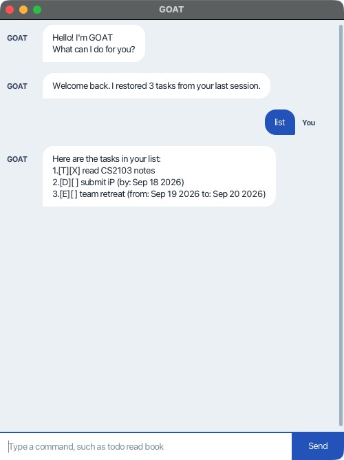

# GOAT User Guide

GOAT keeps your tasks, deadlines, and events in one small chat window.
Type a command, press **Enter** (or click **Send**), and get back to your day.



## Get started

1. Install **Java 25**. Check with `java -version` in your terminal.
   On macOS, use the [course-prescribed Zulu JavaFX JDK 25](https://se-education.org/guides/tutorials/javaInstallationMac.html).
2. Download **goat.jar** from the [latest release](https://github.com/iians0n/ip/releases/latest).
3. Put it in a folder where you can save files. Open a terminal in that folder and run:

   ```sh
   java -jar goat.jar
   ```

The window is titled **GOAT**. No separate Gradle or JavaFX installation is
needed by Windows/Linux users. The macOS test used Zulu's JavaFX JDK 25.

## Your commands

Commands and date markers are lowercase. Surrounding spaces and extra spaces
or tabs after the command are fine. Descriptions may contain multiple words.
Enter one command at a time. A vertical bar with a space on each side is
reserved as the saved-data separator.
A blank GUI submission is ignored.

| Command | Example | What happens |
| --- | --- | --- |
| `todo DESCRIPTION` | `todo read CS2103 notes` | Adds a task without a date. |
| `deadline DESCRIPTION /by DATE` | `deadline submit iP /by 2026-09-18` | Adds a task due on that day. |
| `event DESCRIPTION /from START /to END` | `event team retreat /from 2026-09-19 /to 2026-09-20` | Adds an event spanning both dates. |
| `list` | `list` | Shows every task and its number. Takes no arguments. |
| `mark N` | `mark 1` | Marks task 1 complete. |
| `unmark N` | `unmark 1` | Marks task 1 incomplete. |
| `delete N` | `delete 1` | Permanently removes task 1 and renumbers later tasks. |
| `find KEYWORD` | `find retreat` | Finds a case-insensitive substring in descriptions. |
| `on DATE` | `on 2026-09-18` | Shows deadlines due that day and events covering it. |
| `bye` | `bye` | Says goodbye and closes the window after a short pause. Takes no arguments. |

Use **the numbers from `list`** when marking or deleting. Search results are
numbered separately and do not change what `mark`, `unmark`, or `delete` refer
to. A search matches the whole phrase you type; `find team retreat` searches
for that phrase, including its internal space.

`[T]`, `[D]`, and `[E]` mean to-do, deadline, and event. `[X]` means completed;
`[ ]` means incomplete. After the first three add examples and `mark 1`,
`list` shows:

```text
Here are the tasks in your list:
1.[T][X] read CS2103 notes
2.[D][ ] submit iP (by: Sep 18 2026)
3.[E][ ] team retreat (from: Sep 19 2026 to: Sep 20 2026)
```

## Dates and duplicates

Use ISO calendar dates such as **2026-09-18** (`yyyy-mm-dd`). Times, weekdays
such as `Friday`, and dates such as `18/09/2026` are not supported. Impossible
dates such as `2026-02-30` are rejected. Displayed month names are English.

Event dates are **inclusive**: an event may start and end on the same day.
Its end cannot be before its start. Supply each date marker only once and
put `/from` before `/to`. Keep `/by`, `/from`, and `/to` out of descriptions
in commands that use those markers.

GOAT refuses a new task if its type, description, and dates match an existing
one. Case and repeated whitespace in descriptions are ignored for duplicate
checking, even when the existing task is complete. Different task types or
dates are allowed. Existing duplicates in an older save file are preserved.

## Saving and recovery

Successful changes are saved automatically to **`data/goat.txt`**, relative
to the folder from which you launch GOAT. Use the same folder each time to
restore your list. A missing folder or file starts an empty list and is
created on the first successful change. Back up this file before editing it.

If the file contains damaged records, GOAT reports how many it could not read
and lets you view the recoverable tasks. **Changes are disabled**, so the
original data stays intact. An unreadable file also disables changes.

To recover, close GOAT, copy the original file somewhere safe, and repair the
file or its permissions. Restart afterward. To start over without losing the
old data, move the backed-up file out of `data` before restarting. Legacy
free-text dates need converting to ISO dates in your working copy.

The compatible text format is one task per line:

```text
T | 1 | read CS2103 notes
D | 0 | submit iP | 2026-09-18
E | 0 | team retreat | 2026-09-19 | 2026-09-20
```

The status is `0` (incomplete) or `1` (complete). Do not add extra fields.
Blank lines are ignored. Keep your backup until you have checked the restored
list. Save files must be ordinary files, not symbolic links.

If saving fails, **the attempted change is not applied**. Check free disk
space and folder permissions, and back up the file before restarting. GOAT
also refuses to replace a file changed by another app since it was loaded.
Use one GOAT instance per data folder; simultaneous writers are not supported.
Saving requires a filesystem that supports atomic file replacement.

## When something goes wrong

- Unknown command: check the lowercase spelling; the error lists valid commands.
- Missing/repeated parameter: follow the example in the error and use each marker once.
- Invalid task number: run `list` and choose an existing positive number.
- Window does not start: confirm Java **25**, use the terminal command above,
  and check the macOS JDK link if applicable. Download the JAR again if it is incomplete.

You can resize the window and scroll through earlier replies. A command error
leaves the conversation open so you can correct it and continue.
